<p align="center">
  
</p>

<p align="center">
  
  
  
  
  
  
</p>

---

## What is Cortex?

Most headless CMS tools treat AI as a plugin. Cortex treats it as infrastructure. A TypeScript/Fastify core handles content, auth, and REST/GraphQL. A Python/FastAPI worker handles embeddings, RAG pipelines, and semantic search. Both share PostgreSQL with pgvector. If you are building AI features on top of content — not retrofitting them — Cortex was designed for that workflow.

## Architecture

Cortex uses two services with a deliberate division of labour. `cortex-server` (TypeScript/Fastify) owns the content model, API surface, auth, and async job dispatch. `cortex-ai-worker` (Python/FastAPI) owns the AI stack: embeddings, semantic chunking, auto-tagging, and vector indexing. They communicate over Redis queues for async workloads and direct HTTP for synchronous search calls. The result is a system where every layer does exactly what it is best at.

```mermaid
flowchart LR
    subgraph CL ["Client Layer"]
        WEB["Web / Mobile Apps"]
        ADM["Admin UI"]
        CLI["cortex-cli · Go"]
    end

    subgraph CS ["cortex-server · TypeScript / Fastify"]
        direction TB
        REST["Content API · REST"]
        GQL["GraphQL API"]
        AE["Asset Engine"]
        AUTH["Auth & RBAC"]
        GE["Graph Engine"]
        JD["Job Dispatcher"]
    end

    subgraph CW ["cortex-ai-worker · Python / FastAPI"]
        direction TB
        EMB["Embedding Engine"]
        RAG["RAG Pipeline"]
        SC["Semantic Chunker"]
        AT["Auto-tagger"]
        VI["Vector Indexer"]
    end

    subgraph SI ["Shared Infrastructure"]
        direction TB
        PG[("PostgreSQL 16 + pgvector")]
        RE[("Redis 7")]
        S3[("S3-compatible Storage")]
    end

    CL -->|"REST / GraphQL"| CS
    CS -->|"BullMQ async jobs"| RE
    RE -->|"job queue"| CW
    CS <-->|"HTTP · sync search"| CW
    CS --> PG
    CW --> PG
    CS --> S3
    CW --> RE

    style CS fill:#1F5C8B,color:#fff,stroke:#2d7ab5
    style CW fill:#3776AB,color:#fff,stroke:#4a8dc4
    style PG fill:#161B22,stroke:#30363D,color:#7D8590
    style RE fill:#161B22,stroke:#30363D,color:#7D8590
    style S3 fill:#161B22,stroke:#30363D,color:#7D8590
```

<p align="center">
  
</p>



## Features

<table>
<tr>
<th>Content Management</th>
<th>AI & Semantic Search</th>
<th>Infrastructure & Scale</th>
</tr>
<tr>
<td>

✦ Dynamic content type registry<br/>
✦ JSONB-backed entries — no migration per type<br/>
✦ REST + GraphQL APIs, auto-generated<br/>
✦ Field-level validation with Zod<br/>
✦ Content versioning and restore<br/>
✦ Cursor-based pagination

</td>
<td>

✦ **Hybrid search** — BM25 + pgvector with RRF ✅<br/>
✦ Automatic embedding on publish<br/>
✦ Graceful fulltext fallback (no AI worker needed)<br/>
✦ RAG pipeline for LLM context<br/>
✦ Semantic chunking for long content<br/>
✦ Auto-tagging via LLM

</td>
<td>

✦ PostgreSQL 16 with pgvector<br/>
✦ Redis 7 + BullMQ job queues<br/>
✦ S3-compatible asset storage<br/>
✦ Role-based access control<br/>
✦ Drizzle ORM with typed migrations<br/>
✦ Structured audit log

</td>
</tr>
</table>

## Quick Start

**Prerequisites:** Node.js 22 LTS, pnpm 9+, Python 3.12, Docker or Podman.

```bash
# Check prerequisites
bash scripts/check-env.sh

# Clone and install
git clone https://github.com/orchestrator-dev/cortex
cd cortex && pnpm install

# Start infrastructure (PostgreSQL, Redis, MinIO)
pnpm infra:up && pnpm infra:init

# Configure environment
cp .env.example .env   # set ADMIN_EMAIL and ADMIN_PASSWORD

# Run database migrations and seed the first admin account
pnpm db:migrate
pnpm db:seed

# Start the server
pnpm --filter @cortex-cms/server dev

# Verify
curl http://localhost:3000/health
```

Visit [http://localhost:3000/docs](http://localhost:3000/docs) for the interactive API reference.

## Authentication

All content API routes require authentication. Two methods are supported:

**Session cookie** (browser / admin UI)
```bash
# Login — sets an HttpOnly session cookie
curl -c cookies.txt -X POST http://localhost:3000/api/auth/login \
  -H 'Content-Type: application/json' \
  -d '{"email": "admin@cortex.local", "password": "yourpassword"}'

# Use the cookie on subsequent requests
curl -b cookies.txt http://localhost:3000/api/content-types
```

**API key** (CI / server-to-server)
```bash
# Create an API key (session required)
curl -b cookies.txt -X POST http://localhost:3000/api/auth/api-keys \
  -H 'Content-Type: application/json' \
  -d '{"name": "CI key", "scopes": ["content:read:any", "content:create:any"]}'
# → { "rawKey": "ctx_live_..." }  ← stored once, never shown again

# Use the key via Bearer header
curl -H 'Authorization: Bearer ctx_live_...' http://localhost:3000/api/content-types
```

## Creating Your First Content Type

```bash
# All examples below use a Bearer API key — substitute a session cookie if preferred.
EXPORT KEY="ctx_live_..."

# 1. Register a content type
curl -X POST http://localhost:3000/api/content-types \
  -H 'Authorization: Bearer $KEY' \
  -H 'Content-Type: application/json' \
  -d '{
    "name": "article",
    "displayName": "Article",
    "fields": [
      { "type": "text",     "name": "title", "label": "Title", "required": true,  "unique": false, "localised": false },
      { "type": "slug",     "name": "slug",  "label": "Slug",  "required": false, "unique": true,  "localised": false, "generatedFrom": "title" },
      { "type": "richText", "name": "body",  "label": "Body",  "required": false, "unique": false, "localised": true }
    ]
  }'

# 2. Create an entry
curl -X POST http://localhost:3000/api/content/article \
  -H 'Authorization: Bearer $KEY' \
  -H 'Content-Type: application/json' \
  -d '{"data": {"title": "Getting Started with Cortex", "body": "<p>First entry.</p>"}}'

# 3. Fetch entries with a filter
curl -H 'Authorization: Bearer $KEY' \
  'http://localhost:3000/api/content/article?filters[status][eq]=draft&sort=createdAt:desc'
```

## Hybrid Search

Cortex ships a unified search endpoint that blends BM25 full-text and pgvector semantic results using Reciprocal Rank Fusion. It degrades gracefully — if the AI worker is offline, search falls back to pure full-text.

```bash
# Balanced hybrid search (alpha=0.5 blends both signals equally)
curl -H 'Authorization: Bearer $KEY' \
  'http://localhost:3000/api/search?q=getting+started+with+AI&alpha=0.5&limit=10'

# Pure keyword / BM25 only
curl -H 'Authorization: Bearer $KEY' \
  'http://localhost:3000/api/search?q=fastify&alpha=0'

# Pure semantic / vector only
curl -H 'Authorization: Bearer $KEY' \
  'http://localhost:3000/api/search?q=machine+learning+content&alpha=1'

# Autocomplete suggestions (debounced, title prefix match)
curl -H 'Authorization: Bearer $KEY' \
  'http://localhost:3000/api/search/suggest?q=gett&limit=5'
```

**Response shape:**
```json
{
  "data": [
    {
      "id": "entry-cuid",
      "contentType": "article",
      "status": "published",
      "score": 0.01563,
      "matchType": "hybrid",
      "snippet": "…getting <mark>started</mark> with…",
      "chunkText": "matching vector chunk text",
      "data": { "title": "Getting Started with Cortex" }
    }
  ],
  "meta": {
    "query": "getting started with AI",
    "total": 1,
    "alpha": 0.5,
    "latencyMs": 42,
    "embeddingProvider": "nomic-embed-text"
  }
}
```

**Alpha parameter:** 0 = pure BM25 keyword, 1 = pure vector semantic, 0.5 = balanced. Documents appearing in both result sets rank highest at any non-extreme alpha.

## Stack

| Layer | Technology |
|---|---|
| API Server | Fastify 4 (TypeScript) — plugin-driven, schema-first, fast cold start |
| Admin UI | React + Vite — served by cortex-server in production |
| AI Pipeline | FastAPI (Python) — owns embeddings, RAG, and vector ops where Python excels |
| Database | PostgreSQL 16 — relational correctness, JSONB for flexible content data |
| Vector Search | pgvector — semantic search co-located with content, no external vector DB |
| Object Storage | S3-compatible (MinIO in dev) — swap to any provider via env config |
| Job Queue | BullMQ over Redis — durable async dispatch for AI indexing jobs |
| Auth | Session-based (Lucia v3) + API key RBAC — no third-party auth service required |
| CLI | Go — single static binary for `init`, `dev`, and `migrate` commands |

## Roadmap

| Phase | Milestone | Status |
|---|---|---|
| 1 | CMS Foundation — content engine, REST/GraphQL API, auth & RBAC, webhooks | ✅ v0.1.0 |
| 2 — Month 5 | AI Worker — embeddings, pgvector indexing, 3 provider adapters | ✅ v0.2.0 |
| 2 — Month 6 | Hybrid Search — BM25 + pgvector + RRF, `/api/search`, graceful fallback | ✅ v0.3.0 |
| 2 — Month 7 | RAG Pipeline — LlamaIndex integration, chunk retrieval, LLM context assembly | 🟡 Next |
| 2 — Month 8 | Knowledge Graph — entity linking, relationship traversal | ⚪ Planned |
| 3 | Scale & Ecosystem — multi-tenant, SDK, plugin API, hosted offering | ⚪ Planned |


## Contributing

Cortex is Apache 2.0 licensed. The contributing guide is in `CONTRIBUTING.md` — it covers branch conventions, commit format, and how to run the full test suite. If you use Antigravity IDE, the `.agent/` directory contains skills and rules for AI-assisted development on this codebase. Open issues are the right place to discuss features before sending a PR — it saves everyone time.

## Licence

Apache 2.0 — see [LICENSE](LICENSE).
