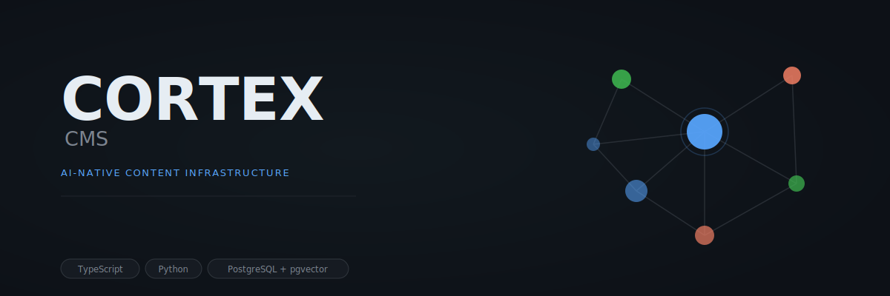
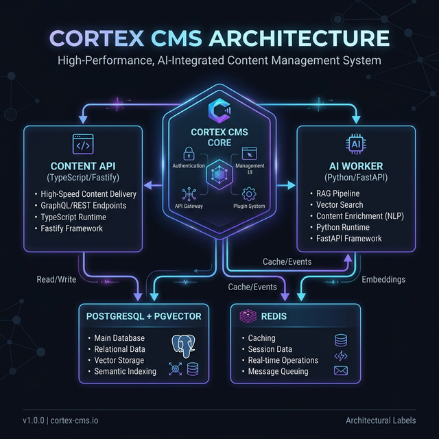

<p align="center">
  
</p>

<p align="center">
  
  
  
  
  
</p>

---

## What is Cortex?

Most headless CMS tools treat AI as a plugin. Cortex treats it as infrastructure. A TypeScript/Fastify core handles content, auth, and REST/GraphQL. A Python/FastAPI worker handles embeddings, RAG pipelines, and semantic search. Both share PostgreSQL with pgvector. If you are building AI features on top of content — not retrofitting them — Cortex was designed for that workflow.

## Architecture

Cortex uses two services with a deliberate division of labour. `cortex-server` (TypeScript/Fastify) owns the content model, API surface, auth, and async job dispatch. `cortex-ai-worker` (Python/FastAPI) owns the AI stack: embeddings, semantic chunking, auto-tagging, and vector indexing. They communicate over Redis queues for async workloads and direct HTTP for synchronous search calls. The result is a system where every layer does exactly what it is best at.

```mermaid
flowchart LR
    subgraph CL ["Client Layer"]
        WEB["Web / Mobile Apps"]
        ADM["Admin UI"]
        CLI["cortex-cli · Go"]
    end

    subgraph CS ["cortex-server · TypeScript / Fastify"]
        direction TB
        REST["Content API · REST"]
        GQL["GraphQL API"]
        AE["Asset Engine"]
        AUTH["Auth & RBAC"]
        GE["Graph Engine"]
        JD["Job Dispatcher"]
    end

    subgraph CW ["cortex-ai-worker · Python / FastAPI"]
        direction TB
        EMB["Embedding Engine"]
        RAG["RAG Pipeline"]
        SC["Semantic Chunker"]
        AT["Auto-tagger"]
        VI["Vector Indexer"]
    end

    subgraph SI ["Shared Infrastructure"]
        direction TB
        PG[("PostgreSQL 16 + pgvector")]
        RE[("Redis 7")]
        S3[("S3-compatible Storage")]
    end

    CL -->|"REST / GraphQL"| CS
    CS -->|"BullMQ async jobs"| RE
    RE -->|"job queue"| CW
    CS <-->|"HTTP · sync search"| CW
    CS --> PG
    CW --> PG
    CS --> S3
    CW --> RE

    style CS fill:#1F5C8B,color:#fff,stroke:#2d7ab5
    style CW fill:#3776AB,color:#fff,stroke:#4a8dc4
    style PG fill:#161B22,stroke:#30363D,color:#7D8590
    style RE fill:#161B22,stroke:#30363D,color:#7D8590
    style S3 fill:#161B22,stroke:#30363D,color:#7D8590
```

<p align="center">
  
</p>



## Features

<table>
<tr>
<th>Content Management</th>
<th>AI & Semantic Search</th>
<th>Infrastructure & Scale</th>
</tr>
<tr>
<td>

✦ Dynamic content type registry<br/>
✦ JSONB-backed entries — no migration per type<br/>
✦ REST + GraphQL APIs, auto-generated<br/>
✦ Field-level validation with Zod<br/>
✦ Content versioning and restore<br/>
✦ Cursor-based pagination

</td>
<td>

✦ pgvector semantic search<br/>
✦ Automatic embedding on publish<br/>
✦ RAG pipeline for LLM context<br/>
✦ Semantic chunking for long content<br/>
✦ Auto-tagging via LLM<br/>
✦ Hybrid keyword + vector queries

</td>
<td>

✦ PostgreSQL 16 with pgvector<br/>
✦ Redis 7 + BullMQ job queues<br/>
✦ S3-compatible asset storage<br/>
✦ Role-based access control<br/>
✦ Drizzle ORM with typed migrations<br/>
✦ Structured audit log

</td>
</tr>
</table>

## Quick Start

**Prerequisites:** Node.js 22 LTS, pnpm 9+, Python 3.12, Docker or Podman.

```bash
# Check prerequisites
bash scripts/check-env.sh

# Clone and install
git clone https://github.com/orchestrator-dev/cortex
cd cortex && pnpm install

# Start infrastructure (PostgreSQL, Redis, MinIO)
pnpm infra:up && pnpm infra:init

# Configure environment
cp .env.example .env

# Run database migrations
pnpm db:migrate

# Start the server
pnpm --filter @cortex-cms/server dev

# Verify
curl http://localhost:3000/health
```

Visit [http://localhost:3000/docs](http://localhost:3000/docs) for the full API reference.

## Creating Your First Content Type

```bash
# That's it. Your REST and GraphQL APIs are live.

# 1. Register a content type
curl -X POST http://localhost:3000/api/content-types \
  -H 'Content-Type: application/json' \
  -d '{
    "name": "article",
    "displayName": "Article",
    "fields": [
      { "type": "text",     "name": "title",  "label": "Title",  "required": true,  "unique": false, "localised": false },
      { "type": "slug",     "name": "slug",   "label": "Slug",   "required": false, "unique": true,  "localised": false, "generatedFrom": "title" },
      { "type": "richText", "name": "body",   "label": "Body",   "required": false, "unique": false, "localised": true }
    ]
  }'

# 2. Create an entry (slug is auto-generated from title)
curl -X POST http://localhost:3000/api/content/article \
  -H 'Content-Type: application/json' \
  -d '{ "data": { "title": "Getting Started with Cortex", "body": "<p>First entry.</p>" } }'

# 3. Fetch entries with a filter
curl 'http://localhost:3000/api/content/article?filters[status][eq]=draft&sort=createdAt:desc'
```

## Stack

| Layer | Technology |
|---|---|
| API Server | Fastify 4 (TypeScript) — plugin-driven, schema-first, fast cold start |
| Admin UI | React + Vite — served by cortex-server in production |
| AI Pipeline | FastAPI (Python) — owns embeddings, RAG, and vector ops where Python excels |
| Database | PostgreSQL 16 — relational correctness, JSONB for flexible content data |
| Vector Search | pgvector — semantic search co-located with content, no external vector DB |
| Object Storage | S3-compatible (MinIO in dev) — swap to any provider via env config |
| Job Queue | BullMQ over Redis — durable async dispatch for AI indexing jobs |
| Auth | Session-based (Lucia v3) + API key RBAC — no third-party auth service required |
| CLI | Go — single static binary for `init`, `dev`, and `migrate` commands |

## Roadmap

| Phase | Theme | Status |
|---|---|---|
| 1 | CMS Foundation — content engine, REST API, Drizzle schema, auth | 🟡 In Progress |
| 2 | AI & Semantic Search — embeddings, RAG pipeline, vector indexing | ⚪ Planned |
| 3 | Knowledge Graph — entity linking, relationship traversal, graph queries | ⚪ Planned |
| 4 | Scale & Ecosystem — multi-tenant, SDK, plugin API, hosted offering | ⚪ Planned |

## Contributing

Cortex is Apache 2.0 licensed. The contributing guide is in `CONTRIBUTING.md` — it covers branch conventions, commit format, and how to run the full test suite. If you use Antigravity IDE, the `.agent/` directory contains skills and rules for AI-assisted development on this codebase. Open issues are the right place to discuss features before sending a PR — it saves everyone time.

## Licence

Apache 2.0 — see [LICENSE](LICENSE).
